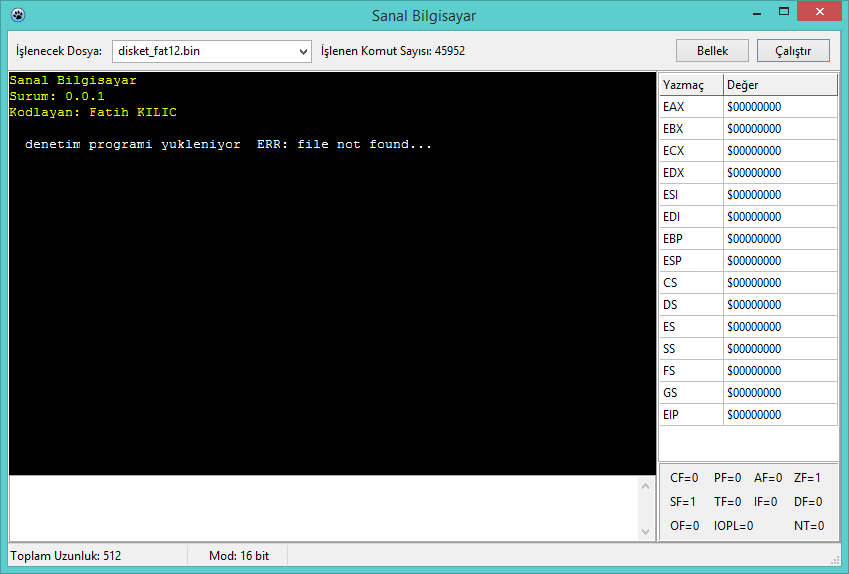
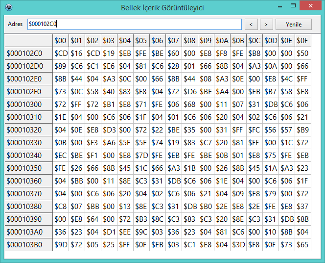

# sb - Sanal Bilgisayar

Sanal Bilgisayar projesi, x86 mimarisinin 8/16/32 bit kodlarını sanal olarak işleyebilme kabiliyetine sahip sanal makine projesidir

## Ekran Görüntüleri

## İletişim

Fatih KILIÇ - hs.fatih.kilic at gmail.com